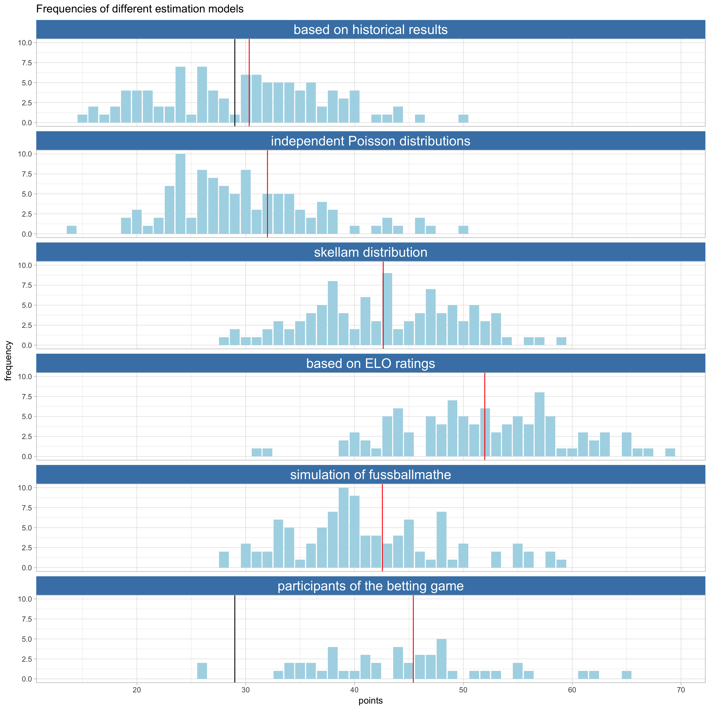

# World Cup predictions

I compare different predictions for the group stage of the World Cup 2018.
My function are based on the one from Claus Ekstrøm which can be found [here](https://github.com/ekstroem/socceR2018).

The main result is, taht if you want a good prediction, you should probaly
consider using the ELO ratings.
For more Detail see our blog post about it [here](https://www.statworx.com/de/blog/)

The plot down below shows the result of 100 siulations with the following
point system:

|         | trend | goal difference | result |
| :-----: | :---: | :-------------: | :----: |
| Victory |   2   |        3        |   4    |
|  Draw   |   2   |        -        |   4    |

### Comparison of prediction methods

### 

