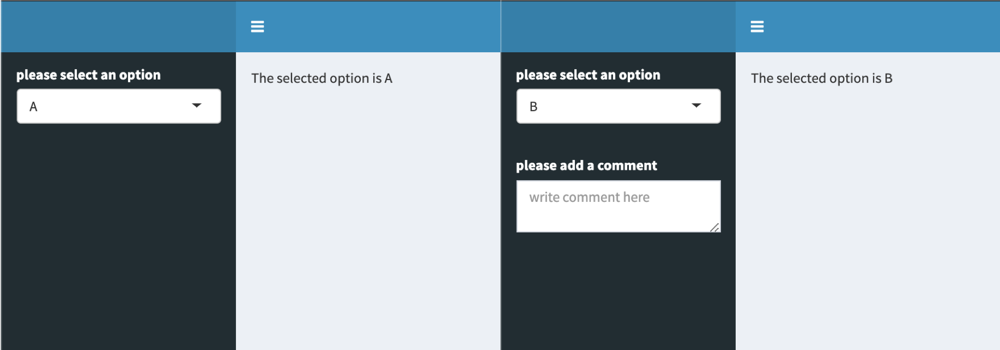

# Dynamic UI Elements in Shiny - Part 2

At [STATWORX](http://www.statworx.com), deploying our project results with the help of Shiny has become part of our daily business. Shiny is a great way of letting users interact with their own data and the data science products that we provide. 

Applying the philosophy of reactivity to your app's UI is an interesting way of bringing your apps closer in line with the spirit of the Shiny package. Shiny was designed to be reactive, so why limit this to only the server-side of your app? Introducing dynamic UI elements to your apps will help you reduce visual clutter, make for cleaner code and enhance the overall feel of your applications. 

I have previously discussed the advantages of using `renderUI` in combination with `lapply` and `do.call` in the [first part](https://www.statworx.com/at/blog/dynamic-ui-elements-in-shiny/) of this series on dynamic UI elements in Shiny. Building onto this I would like to expand our toolbox for reactive UI design with a few more options.

##The objective

In this particular case we're trying to build an app where one of the inputs reacts to another input dynamically. Let's assume we'd like to present the user with multiple options to choose from in the shape of a `selectInput`. Let's also assume that one of the options may call for more input from the user, let's say a comment, to more clearly explain the previous selection. One way to do this would be to add a static `textInput` or similar to the app. A much more elegant solution would be to conditionally render the second input to only appear if the proper option had been selected. The image below shows how this would look in practice.



There are multiple ways of going about this in Shiny. I'd like to introduce two of them to you, both of which lead to the same result but with a few key differences between them. 

##A possible solution: `req`

###What `req` is usually used for

`req` is a function from the Shiny package whose purpose is to check whether certain requirements are met before proceeding with your calculations inside a reactive environment. Usually this is used to avoid red error messages popping up in your ShinyApp UI when an element of your app depends on an input that doesn't have a set value yet. You may have seen one of these before:


These errors usually disappear once you have assigned a value to the needed inputs. `req` makes it so that your desired output is only calculated once its required inputs have been set, thus offering an elegant way to avoid the rather garish looking error messages in your app's UI. 

###How we can make use of `req`

In terms of reactive UI design we can make use of `req`'s functionality to introduce conditional statements to our `uiOutputs`. This is achieved by using `renderUI` and `req` in combination as shown in the following example: 

```R
output$conditional_comment <- renderUI({
    # specify condition
    req(input$select == "B")
  
    # execute only if condition is met
    textAreaInput(inputId = "comment", 
                  label = "please add a comment", 
                  placeholder = "write comment here") 
  })
```

Within `req` the condition to be met is specified and the rest of the code inside the reactive environment created by `renderUI` is only executed if that condition is met. What is nice about this solution is that if the condition has not been met there will be no red error messages or other visual clutter popping up in your app, just like what we've seen at the beginning of this chapter.

##A simple example app:

Here's the complete code for a small example app:

```R
library(shiny)
library(shinydashboard)

ui <- dashboardPage(
  
  dashboardHeader(),
  dashboardSidebar(
    selectInput(inputId = "select", 
                label = "please select an option", 
                choices = LETTERS[1:3]),
    uiOutput("conditional_comment")
  ),
  dashboardBody(
    uiOutput("selection_text"),
    uiOutput("comment_text")
  )
)

server <- function(input, output) {
  
  output$selection_text <- renderUI({
    paste("The selected option is", input$select)
  })
  
  output$conditional_comment <- renderUI({
    req(input$select == "B")
    textAreaInput(inputId = "comment", 
                  label = "please add a comment", 
                  placeholder = "write comment here")
  })
  
  output$comment_text <- renderText({
    input$comment
  })
}

shinyApp(ui = ui, server = server)
```

If you try this out by yourself you will find that the comment box isn't hidden or disabled when it isn't being shown, it simply doesn't exist unless the `selectInput` takes on the value of "B". That is because the `uiOutput` object containing the desired `textAreaInput` isn't being rendered unless the condition stated inside of `req` is satisfied.

### `conditionalPanel`

Out of all the tools available for reactive UI design this is probably the most widely used. The results obtained with `conditionalPanel` are quite similar to what `req` allowed us to do in the example above, but there are a few key differences. 

###How does this differ from `req`?

`conditionalPanel` was designed to specifically enable Shiny-programmers to conditionally show or hide UI elements. Unlike the `req`-method, `conditionalPanel` is evaluated within the UI-part of the app, meaning that it doesn't rely on `renderUI` to conditionally render the various inputs of the shinyverse. But wait, you might ask, how can Shiny evaluate any conditions in the UI-side of the app? Isn't that sort of thing always done in the server-part? Well yes, that is true if the expression is written in R. To get around this, `conditionalPanel` relies on JavaScript to evaluate its conditions. After stating the condition in JS we can add any given UI-elements to our `conditionalPanel` as shown below:

```R
conditionalPanel(
      # specify condition
      condition = "input.select == 'B'",
  
      # execute only if condition is met
      textAreaInput(inputId = "comment", 
                    label = "please add a comment", 
                    placeholder = "write comment here")
    )
```

This code chunk displays the same behaviour as the example shown in the last chapter with one major difference: It is now part of our ShinyApp's UI-function unlike the `req`-solution, which was a `uiOutput` calculated in the server-part of the app and later passed to our UI-function as a list-element. 

###A simple example app: 

Rewriting the app to include `conditionalPanel` instead of `req` yields a script that looks something like this:

```R
library(shiny)
library(shinydashboard)

ui <- dashboardPage(
  
  dashboardHeader(),
  dashboardSidebar(
    selectInput(inputId = "select", 
                label = "please select an option", 
                choices = LETTERS[1:3]),
    conditionalPanel(
      condition = "input.select == 'B'",
      textAreaInput(inputId = "comment", 
                    label = "please add a comment", 
                    placeholder = "write comment here")
    )
  ),
  dashboardBody(
    uiOutput("selection_text"),
    textOutput("comment_text")
    )
)

server <- function(input, output) {
  
  output$selection_text <- renderUI({
    paste("The selected option is", input$select)
  })
  
  output$comment_text <- renderText({
    input$comment
  })
}

shinyApp(ui = ui, server = server)
```

With these two simple examples we have now demonstrated multiple ways of letting your displayed UI elements react to how a user interacts with your app - both on the server, as well as the UI side of the application. In order to keep things simple I have used a basic `textAreaInput` for this demonstration, but both `renderUI` and `conditionalPanel` can hold so much more than just a simple input element. 

So get creative and utilize these tools, maybe even in combination with the functions from [part 1 of this series](https://www.statworx.com/at/blog/dynamic-ui-elements-in-shiny/), to make your apps even shinier!

[author class="mtl" title="Über den Autor"]
[global_block block="15819"]