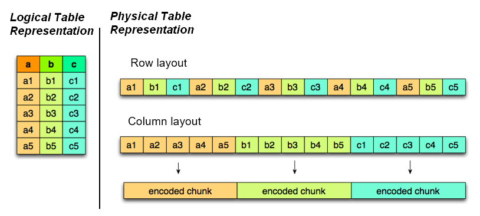

# Naive Considerations on Delta Lake querying

Lakehouse is a prominent data approach for managing huge volumes. The main idea is the use of the columnar format parquet, put some metadata on top of that to basically ensure transactional writes and store it to cheap storage (object storages like S3, ADLS, etc). When I was working with that approach, I questioned the efficiency of the approach and my naive understanding was that all data would always to be read to process the data or to query it for reporting purposes. (Disclamer: this is not true). This is a uncovering.
First of all, I want to introduce main requirements from batch processing and ad-hoc querying, then move level by level to see what features are given. 
The main optimizations, though, take place on the parquet level.

## Different requirements ad-hoc queries vs. batch processing
With ad-hoc queries an interface for a user/application is meant that can quasi-randomly execute queries on some data sets.
With batch processing a well-defined (i.e. well-known) and deployed process is meant that runs on a regular schedule, loads some data, processes it and stores it back.
Let us consider different dimensions.

### Latency / Efficiency
Batch processing does not rely on latency, however execution efficiency is still a valid metric to consider as it saves money.
Ad-hoc queries definitely require good latency performance for user's trust and the business value. Latency is a part of the execution efficiency of the query. The efficiency of the whole process (may include storage, preaggregation) is a rather subordinal measure.

### Reliability / Precision
Batch processing shall be resilient to downtimes of connected upstream system, shall be able to restore failed tasks, shall calculate the outcome in a precise manner as downstream processes rely on the output, shall produce the same outcome on the same data (idempotency).
Ad-hoc queries' requirements are different: Value estimates instead of precise values (thinking of Theta sketches) are acceptable in various situations. Also recalcualting a value in case of an outage is supposed to be acceptable if that does not occur too often. However, the overall query service downtime should be reduced.

### Data Layout
The data layout shall enable good query performances on different kind of queries. Batch processing, having the nature of a defined process, uses specific queries that the layout can be optimized towards.

### Scalability
Both types need scalability but in different aspects. The batch process and the backend need to adapt with rising amount of data. This, in general, is observable and can be remediated by adding more components to the scalable backend. With the regards to ad-hoc queries, the scalability requirements also encloses the (unknown) rise in the number of queries.

## Performance Measures implemented in Parquet
### Due to the nature of a columnar format

(Different representation of data: Row and Column layout)

Parquet is a columnar format. Data is not stored row-wise as in the more familiar CSV format but column-wise. 
To be more precise, data sets are split up into row groups (= slices of rows) and within the groups, each column data is stored as a block together. See also the image above.
Thus, whenever readers are supposed to read only a subset of columns, readers can first look up the offset of the needed column blocks, and read those portions over network and/or into RAM. The [parquet-format](https://github.com/apache/parquet-format#file-format) gives you the a better feeling how the format is structured and - for instance - how to find out the offsets.
For wide tables (= many columns), this can save a lot of unnecessary data reads. When we think of slice and dice queries (= filtering and aggregation), which is pretty commonly used in analytical workflows, it also has the adventage that data is a block layout for aggregation computations.

### Statistics

Secondly, lets have a look how the number of data reads can be reduced. Parquet allows to **store statistics** of columns for minimal and maximal values within the metadata. Data pages not matching a filter clause can by that be omitted.
Moreover, since version 2.5.0, the specification includes an extra column index, that stores the min-max values as a separate block of the metadata. 
A reader implementation could first filter against those min-max ranges to get the necessary data offsets and then start reading. Even better: when the column is sorted (is a flag in the metadata), the reader can perform a binary search on the min-max pairs. 
To test the occurence of an element in a column, a min-max ranges could act as a prefilter and the dictionary of the encoding can be used to look up the element. 
However, high cardinality of distinct values, would blow up the dictionary. A good compromise is a **Bloom Filter** that is part of the format specification since version 2.7.0. 
Briefly, let's have some words on how a Bloom Filter works: 
A Bloom Filter is an efficient approximation to a set that produces false positives but no true negatives.
The bloom filter is a bit array of fixed size whose bits are initially all set to zero. 
A given element is represented by the outcome of several different hash functions. For a member of the set, the value of the corresponding positions to the hash functions in the bit array are set to 1.
To check if an element is a member of the set, again the positions are calculated by the hash functions and the Bloom Filter asserts the membership if all are 1.  
For a given false positive rate, the length of the bit array and the number of hash functions can be calculated. 
(See [Bloom Filter Wikipedia](https://en.wikipedia.org/wiki/Bloom_filter))
As another small bit worth to mention, the parquet metadata stores **several count statistics**: The number of rows, the number of null values per column within a row group and within a data page, the number of distinct values within a row group and within a data page. Hence, as long as the count query is simple, the value can be looked up instead of counting rows by a program.

### Supported Features of Writer Implementation
Having first a look at Pandas and let's restrict to the underlying engine of pyarrow. Currently the versions 1.0, 2.4 and 2.6 are supported, see [Pyarrow](https://arrow.apache.org/docs/python/generated/pyarrow.parquet.write_table.html#pyarrow.parquet.write_table). In addition, writing statistics can be restricted to a handful of columns instead of all (parameter: `write_statistics`)

Spark on the other hand relies on `parquet-mr` and starting with version 1.11.0 the parquet format version 2.7.0 is integrated. With Spark version 3.2.0 and higher it integrates `parquet-mr` version 1.12.1 and higher.

## Performance Measures implemented in Delta Tables
### Statistics
According to the [Delta Table specifications](https://github.com/delta-io/delta/blob/master/PROTOCOL.md#per-file-statistics), statistics for min and max value can be added to the Delta log. Like in the parquet implementation, this enables data skipping but now on a higher level: skipping whole files instead to columns from row groups. Also similar to the parquet format, count statistics of rows and null values of columns are stored in the metadata. 

### Apart from Statistics
Delta as format does not provide any further mechanism to improve the query performance. Databricks, however, added some tool to the box that further could improve the performance:
**Z order** is a mechanism to achieve sorting on multiple fields. Thus, data can be sorted before and then broken up into files. This makes data skipping much more efficient, when filtered on a subset of the field in the Z order set. 
Databricks also implemented a **Bloom Filter Index** that works in the same fashion as for Parquet files. The implementation has not been open sourced yet. The index is stored separately in files.

### Comment on Iceberg
Iceberg is a competitor for Delta Tables. As of now, no real standard measure has been found for data reads.

## Comments on modern Object Storages
Nowadays, data resides mostly on object stores like S3 or Azure's Blobstorage. The main feature that would ensure a smart approach to data reads is that data can be read partially with ranges. 
Both Azure REST API implementation as well as S3 support such byte range reads. 

## Summary
It's far better than expected: On both Parquet and Delta level, with stored statistics readers are enabled to skip data and to scan only necessary data chunks. Overall min-max statistics on ordered columns provide an index structure that can be exploited. Membership of elements can be either checked in dictionaries or by asking the Bloom Filter structure.
Still, OLAP stores like [Pinot](https://pinot.apache.org/) or [Clickhouse](https://clickhouse.com/) will outperform in query performance. 