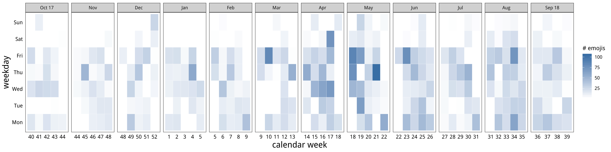
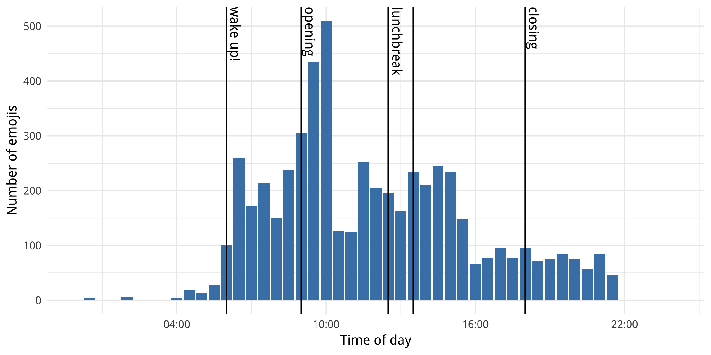
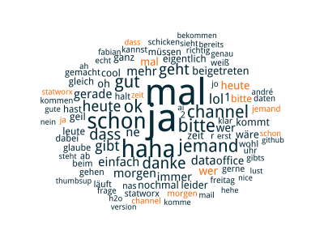
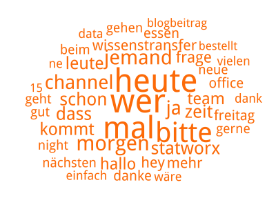
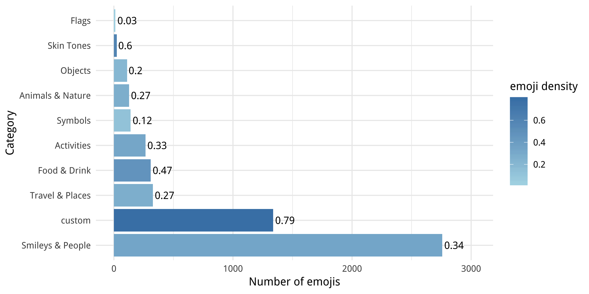
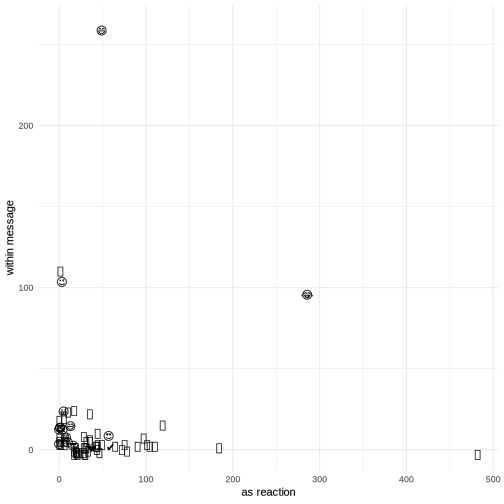
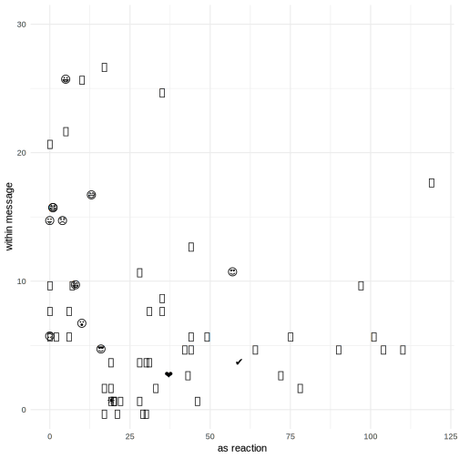
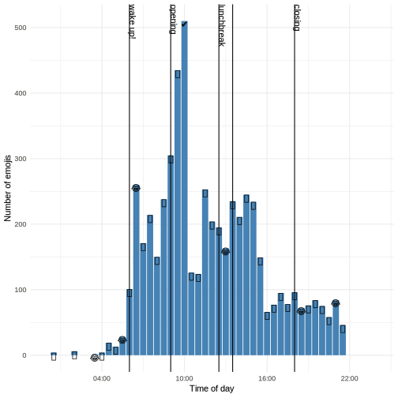

# How we use emojis

Once upon a time, we at [STATWORX](https://www.statworx.com/) used Slack just as a messenger, but than everything changed when the emojis come… Since then, we use them for all kinds of purposes. For example we take polls with them to see were we will eat lunch or we capture unforgettable moments by creating new emojis. The possibilities are limitless! But since we use them so much, I was wondering how often we use them. And when? And which is the top-emoji?! Is is just the *thumbsup*?

To answer all these questions, I went on a little journey troughout my emotions. 

## Getting the data

The first part was to gather data. Well, since nearly every tool has a log history this was quite simple. I Just had to get the history (the last year) of our Slack channels which was provided within JSONS. These I could easily load into R with the `jsonlite` package. To get a list of all possible emojis, I found [this list](https://github.com/iamcal/emoji-data/blob/master/categories.json) from Cal Henderson who works at Slack. I added our own custom emojis to complete the list.

All that followed, was a little loop to go though each message and its reactions and count the occurences of each emoji. Combined with the timestamp given in seconds from Janauary the first in 1970, I had my emoji time series data that looked like this:

```
                     EMOJI COUNT     TIME     TYPE       DATE
1: :slightly_smiling_face:     1 08:56:05  message 2018-08-10
2: :slightly_smiling_face:     1 17:08:19  message 2018-08-10
3:                  :gift:     2 08:36:04 reaction 2018-08-18
4:                   :joy:     1 13:47:10 reaction 2018-09-03
5:                    :+1:     1 13:56:12 reaction 2018-09-04
```

After evaluating each single text I found that more than every second chat (57%) either has an emoji in the messasge or as a reaction. So we really use them a lot! 


## the right timing

Since the majority was used as a reaction, I summed them up and did not distinguished between messages and reactions. To get a first idea of how often and when we use emojis I looked at a frequency plot over time. There are two things to notice: First, we see an increase over time. Well our company grew, so more people equals more emojis. Second, we tent to not use them during the weekend - how would have thought!?



But what about our daily usage? Well there seem to be some peaks. One after we wake up and an other one when we come into the office. Here we can distinguish bewteen colleagues with the mobil app and the ones that *just* use Slack with the Desktop app. Also it peaks a bit around our lunchbreak and it comes all to end before we go to bed.




## cause and effect

Since I started this little project more and more questions popped into my head. For example: Is there a link between the emoji's usage within a message and as a reaction? Are there words, that trigger us to use emojis?
To answer the first questions, I used the `networkD3` package to plot the interaction as a sankey diagram.

add  HTML link

Here we can see which categories of emojis used within a message lead to which reactions. The most used category is **Smileys & People** followed by **custom**. And around 40% stay within the same category. 

To anwser the second question I made some wordclouds to see which words we use. The ones in orange are those where a reaction followed. 



We can see, that we use more words with no emoji reaction than the other way around. If we look only at the ones were an emoji reaction occurs, then we get the following picture.



Seems that if we ask a question "heute wer mal bitte …" (*"today someone please…"*) we get an reaction - mostly positive.


##the most common emojis



As we can see in the plot above, we use the emoji's categories diffrently. First of all, **Smileys and People** are used the most. But if we look at the number of possible emojis wihtin the categories - we only use a third of  them. On the other hand, nearly 80% of our custom emojis were used.

To find the most common used emojis I looked at the top 50 emojis within messages and reactions. Also I stumbled upon two R packages (`emoGG`  and `emojifont`) which let you add emojis to your `ggplots`.  This sounded wonderfull, but there was a catch! Since we work with RStudio on a Mac I could not use the RStudio plotting device, since it would not show the emojis. After a little bit of research I found [this post here](https://stackoverflow.com/questions/47730589/plot-emojis-emoticons-in-r-with-ggplot), which suggested to use `quartz()` and `grid.export` with `.svg` for the plotting. The loaded font obviously did not have our own emojis, so I just added them as❓. 



So as I thought at the beginning our top emoji is just the 👍, followed by 😂 and 😄.

| Emoji | message | as reaction | total |
| :---: | :-----: | :---------: | :---: |
|   👍   |    0    |     482     |  482  |
|   😂   |   98    |     281     |  379  |
|   😄   |   260   |     49      |  309  |

 But since there is a lot going on in the lower left corner -  let's have a closer look!



With this package we can also update the plot with our daily usage with the most used one at the time.



## conclusion

With this little project I just scratched the surface of possobilities to analyse the usage of emojis. If you have more ideas, I would like to see your approach and solutions. Just send me an email at blog@statworx.com. To get started you can use my code at our GitHub - not with our whole data of course, but with an example folder with two sons. Here you could add your own Slack history.


## references

- list of emojis
  https://raw.githubusercontent.com/iamcal/emoji-data/master/categories.json
- emojifont package
  https://mran.microsoft.com/snapshot/2016-07-03/web/packages/emojifont/vignettes/emojifont.html
- emoGG package
  https://github.com/dill/emoGG