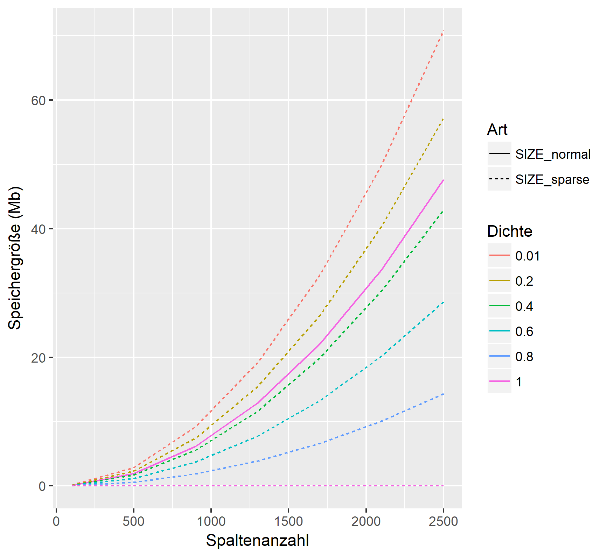
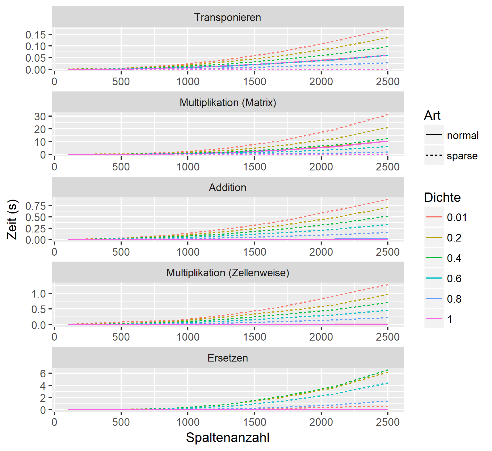

# Benchmark of calculations with sparse matrices

In this simulation I benchmark the usage of sparse matrices. I compare the size and the time of the following operations:

- transpose  
`t(X)`
- crossproduct  
`X %*% t(X)`
- addition  
`X + X`
- multiplication  
`X * X`
- switching  
`X[, c(2,3)] <- X[, c(3,2)]`

For more information and details visit our [blog](https://www.statworx.com/de/blog/sparse-matrizen-wann-sollte-man-sie-nutzen/)!

### Results size

### Results time

